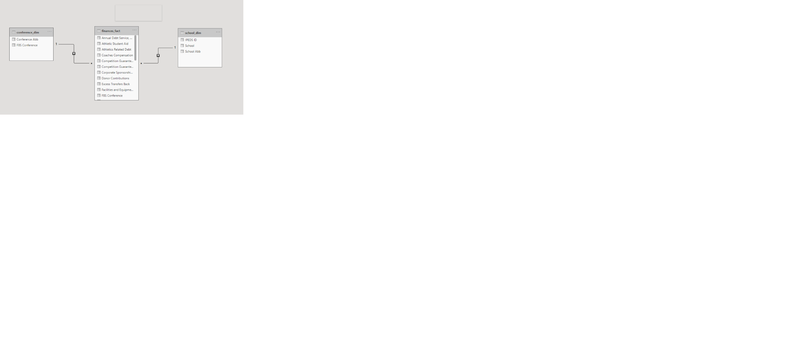

# Week 1

## Requirements

- The first few challenges are going to build on one another, so keep this in mind as we start out the year. 
- Create cleaned data set with only teams from the Football Bowl Division. In order to do this, in the FBS Conferences field exclude the FBA Totals and null values.
Within NCAA Subdivision, remove all Conference Medians
- Create data model properly relating two dim tables to the fact table. 
- Try and use as least amount of steps as possible.
