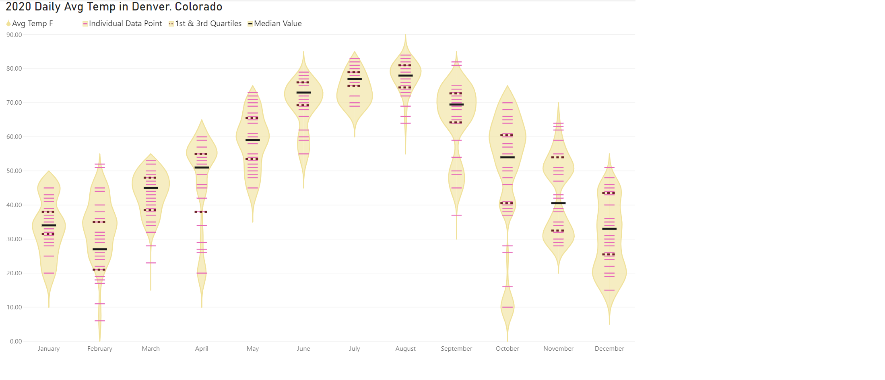

# Week 10

## Requirements

- Create a violin plot that displays average temperature grouped by month name. The average temperature value is provided in both Fahrenheit (the field named Avg Temp F) and Celsius (the field named Avg Temp C). You can use either field according to your preference.
- Use the Epanechnikov (default) kernel and a high sampling resolution for the violin shape. 
- Show lines in the plot for the first and third quartiles and the median.
- Use a text size of at least 12 points for the x-axis and y-axis labels.
- Format the tooltip so that the measures display as integers (show zero decimal places). 
- Title the chart “2020 Daily Average Temperatures in Denver, Colorado”
