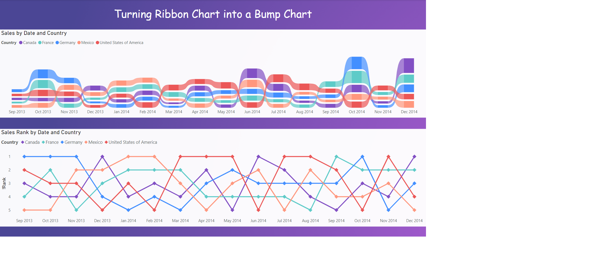

# Week 11

## Requirements

- Use the Financials sample dataset (available in Power BI Desktop from October 2020 onward) 
- Create a Ribbon Chart with a combination of Date, Country, and Sales.
- Create a DAX measure that will rank countries by sales.
- Use a combination of DAX functions SUM, CALCULATE, ALLSELECTED, and RANKX in your measure.
- HINT: Go to the DAX Guide function reference for some examples of how these functions work in general.
- HINT: Expand the Solution below if you get stuck and want a sample measure. If you’ve never touched DAX before, some of these functions can seem intimidating, and 
- Add a Line Chart that includes Date, Country, and your custom sales rank measure.
- Add markers to your line chart.
- Determine a way to make your sales rank on the line chart appear like the ribbon chart. The highest rank value should be at the top of the visual and not the bottom.
- If you had to modify your rank measure to fulfill the prior requirement, be sure that rank values in the line chart’s Y Axis and default Tooltip appear as positive numbers. Use only the existing three fields and no other visuals… 