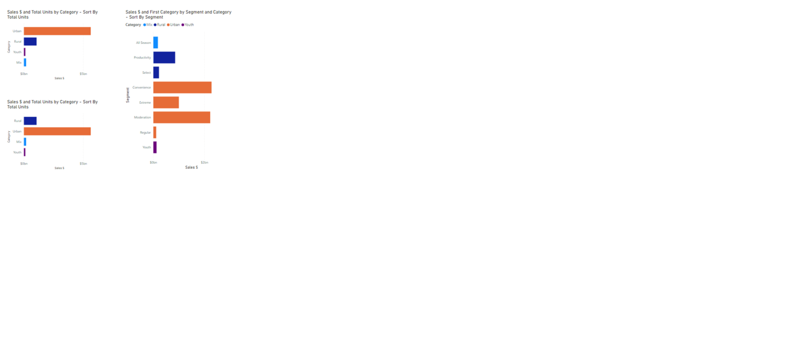

# Week 12

## Requirements

- Connect to the Sales & Marketing sample data set available on PowerBI.com
- Create two bar charts showing Sales $ by Category
- Sort the first bar chart by the Total Units field in descending order
- Sort the second bar chart by a custom field that force ranks the Categories into the following order – Rural, Urban, Mix, Youth