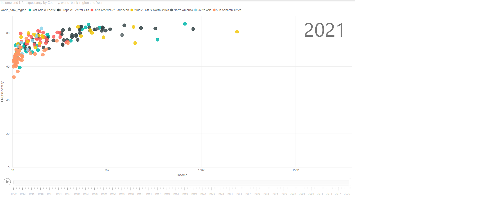

# Week 13

## Requirements

- Bring all tables into Power BI and create a data model.
- Ensure that the income, life expectancy, and population tables are related to the data geographies table.
- Build a bubble chart that shows life expectancy by average income over time
- Ensure that the colors in your bubble chart represent Region and the size of the bubble represents population size
- Build a custom page overlay that gives additional details to end-users about the data included in the report. Do not be afraid to be creative – this does not need to look like the sample! (hint: use a button and bookmark)
- Create a button on your report page that will allow users to display the custom overlay (the question mark in the sample)