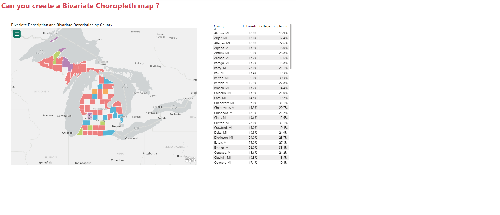

# Week 15

## Requirements

- Read about key concepts behind Bivariate Choropleth maps first: Bivariate Choropleth Maps: A How-to Guide (joshuastevens.net)
- This challenge’s data is already based on percent of population, so don’t worry about normalizing on top of what is provided
- Select a color scale from among the article’s sample options
- In Power Query, merge the two datasets together on FIPS
- In Power Query, cleanup, transform, and add columns as needed to get data into shape
- Hint: You’ll need at least a County column as well as two that I called In Poverty and Completed College that contain numeric data
- After loading the data into your data model, add separate Bins for In Poverty and Completed College
- Note that this could be manually done in Power Query as well, but this demonstrates Power BI’s Groups/Bins feature as well as is easier to work with visually in the UI
- Create a measure that combines the 3×3 combination of values (9 total options)
- Hint: Use the DAX SWITCH function and combine with SELECTEDVALUE. Look at past WOW challenges for help with SWITCH as well. You should end up with nine conditions to match the nine bivariate options.
- Use ArcGIS Maps for Power BI
- Note that some organizations may disable this particular map, in which case you could use the Filled Map as an alternative
- Create a choropleth map using Location (County) and Color (your measure)
- Find and set the map colors to your chosen color scale in the Symbology section
- Mind the map’s tooltip
- Mind the data formatting for percentages