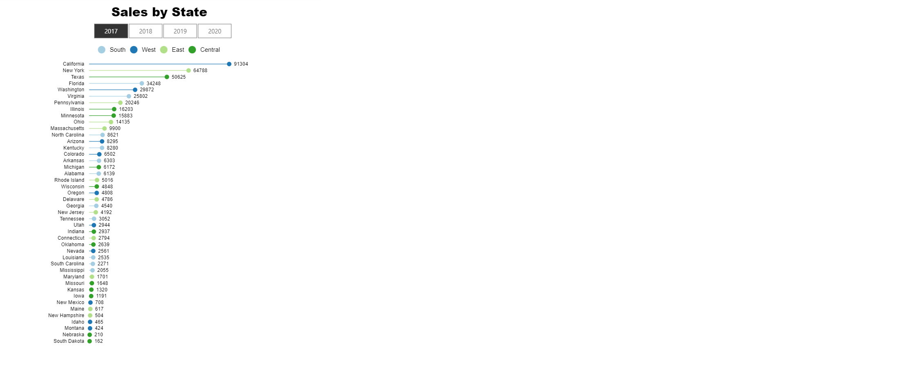

# Week 16

## Requirements

- Create a lollipop chart using the Charticulator template
- The lollipop chart needs to show SUM(Sales) by State (y-axis) 
- Color the State fields by Region
- Change the title to say Sales by State
- Make legend horizontal and fit under the chart title
- Add in horizontal slicer to allow slicing by Year of Order Date