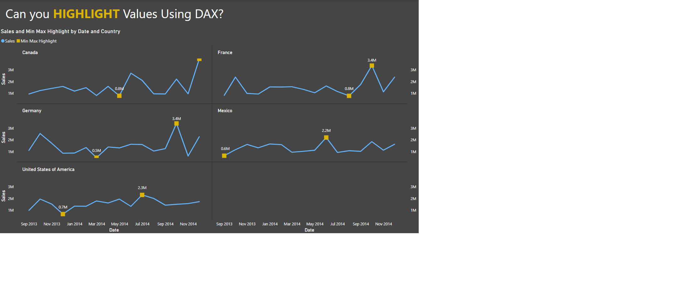

# Week 19

## Requirements

- Create an explicit DAX measure for Sales that sums the Financials[ Sales] column
- Create a DAX measure that uses variables to calculate the MIN and separately the MAX Sales value on any given Date, and then conditionally return a value only if the current Sales value equals a min or max. Apologies if that’s a confusing way of stating it, but look at the sample report embedded above to see how it’s visualized. This measure acts as your “highlight” measure.
- Add your Sales measure and your Highlight measure to a line chart (HINT: use the secondary axis)
- Use Small Multiples on the line chart
- This is a preview feature prior to the May Power BI Desktop release and would need to be enabled manually in Options and Settings–>Options–>Preview features
- If you’ve installed May’s update, you no longer need to manually enable small multiples.
- Set appropriate format options for markers, data labels, etc.
- Set currency formatting