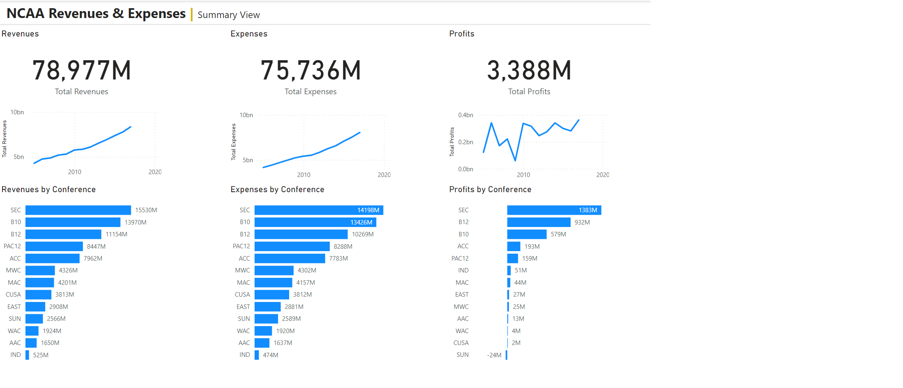

# Week 2

## Requirements

- Create a new field in Power Query (using M) called Total Profits. This field will be calculated by subtracting Total Expenses from Total Revenues and then adding back in Excess Transfers Back.
- The background on this is that in the past few years, the NCAA has allowed schools to exclude money that was transferred back to the main institution (from the athletic department) from showing as profits. By adding back in Excess Transfers Back we are finding the total amount of money generated by the different athletic deparments
- Definition: Positive net revenues generated by athletics and transferred to the institution for non-athletics purposes. These funds are in excess of the transfers subtracted from the institutional and governmental funds allocated to athletics. 
- Create KPI dashboard that includes 3 high level measures: Total Revenues, Total Expenses, and Total Profits. 
Must include a trend line for each category and breakdown by conference.
- Indicate that this view is the Summary level view within the header area. 
Colors and design of the header section is at your discretion.

