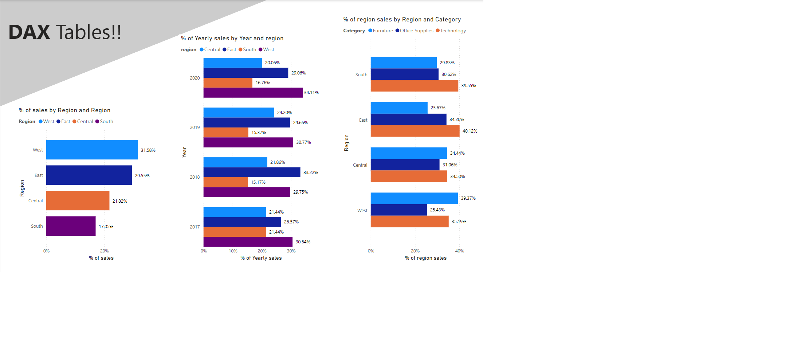

# Week 20

## Requirements

#### Using DAX create the first table using DAX
- SUMMARIZE by Region, create fields for Sum of Sales, Total Sales (All in table), and % of totals sales by Region
#### Using DAX create the second table using DAX
- SUMMARIZE by Region and Order Date Year, create fields for Sum of Sales, Total Sales (All in table), % of total sales by Region & Year, and % of sales by Region for each year
#### Using DAX create the third table using DAX
- For only Year(Order Date) = 2019, SUMMARIZE by Region and Category, create fields for Sum of Sales, Total Sales (All in table), % of total sales by Region &Category, and % of sales for each Region by Category. 
#### Create 3 bar charts showing the % breakdowns
- Show % of total sales by Region
- Show each Region as a % of sales for each Year (Order Date)
- Show each Category as a % of total sales in each Region for 2019 (Order Date) only.