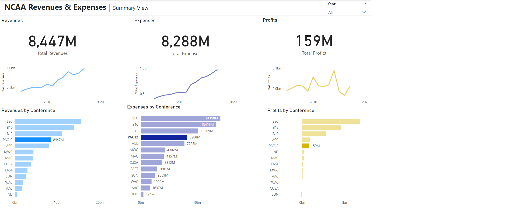

# Week 3

## Requirements

- Add a slicer for Year to the report. 
- Edit Interactions for the slicer to have it only slice the KPIs and bar charts (not trends)
- Edit Interactions of the Conference breakdowns so that they filter the KPIs and Trends on click. 
- Use colors to differentiate between metrics
- Figure out how much money the MAC conference made in 2016

