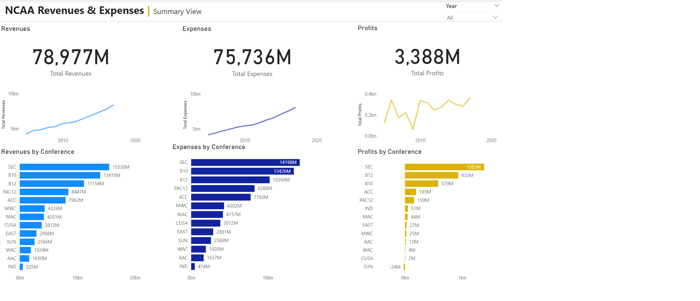

# Week 4

## Requirements

- Create new tab called “School View.” Replace the [Conference Abb] fields in your bar charts with [School Abb]. 
- Create drill through from your Summary View tab to your School View tab. 
- Add card to allow users to know what Conference they are viewing in the School View. 
- Make sure your year slicers are not synced between the two pages. 
- Figure out who contributed most the MAC losing so much money in 2016.
