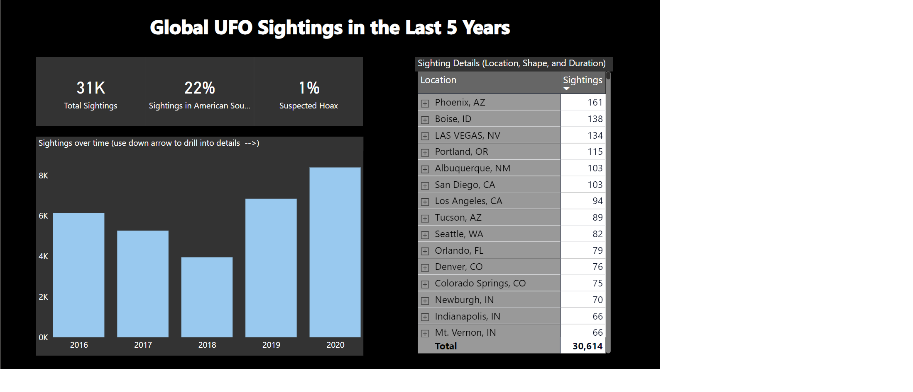

# Week 5

## Requirements

- We are using a new dataset this week. Please download the starter Power BI Desktop file here. Just a quick reminder that you must be on a PC to user Power BI Desktop.
- Note that this dataset is not built out to be a proper dimensional model. As we progress throughout the weeks we will incorporate more data modeling.
- Create 3 card visuals containing the measures: Total Sightings, % in American Southwest, and % Suspected Hoax. Note that these measures already exist in the model.
- Create a column chart containing Total Sightings over Time (using the Posted field for the shared axis)
- Create a matrix visual containing the Total Sightings by Location, Shape, and Duration. Turn on the plus/minus icons to enable an alternate method of drilling up and down for your end users.
- Use the drill-down feature to find the number of Fireball shaped UFO sightings in June 2020 in Las Vegas, NV.
