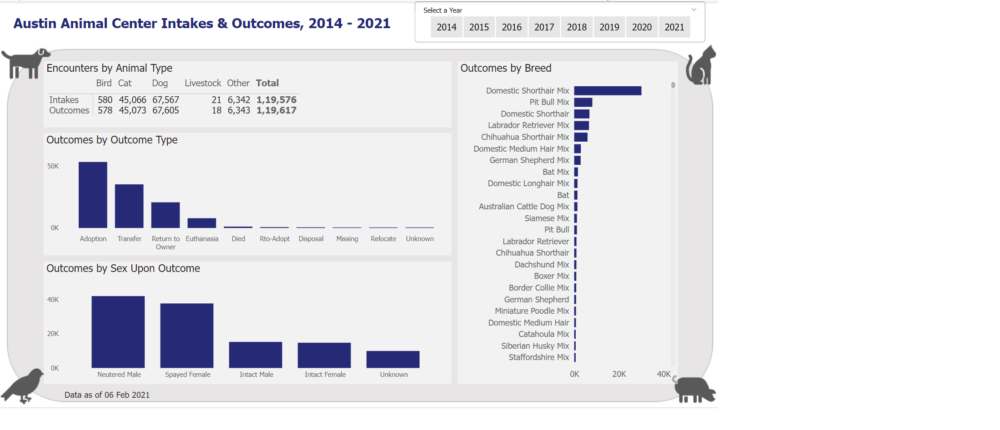

# Week 6

## Requirements

- Filter the report page to show only years after 2013. 
- Create a matrix that shows intakes and outcomes by animal type. The measures should be shown on rows and animal types shown on columns. Set the text size to at least 9 pt.
- Create a column chart to show outcomes by outcome type. Set the text size to at least 9 pt (Note: Because the visual is responsive, it might not actually render as 9pt, but that is ok). All labels on the x-axis should have a horizontal orientation (not diagonal). Some may require wrapping to a second line. 
- Create a column chart to show outcomes by animal sex. Set the text size to at least 9 pt. All labels on the x-axis should have a horizontal orientation (not diagonal). Some may wrap to a second line. 
- Create a bar chart to show outcomes by breed. Set the text size to at least 9 pt. Format the bar chart so that the breeds on the y-axis are not truncated. 
- Create a horizontal slicer with year values. Change the slicer header to read “Select a year to filter the data”. 
- Set the interactions between all visuals on the page to Filter. 
- Use the cross-filtering functionality in the report to find out how many parakeets were adopted (the number of adoption outcomes) in 2020.
- Fonts, colors, and page formatting are at your discretion. If you would like to use the background image shown, you can download it here.