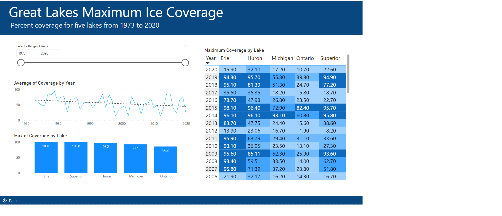

# Week 7

## Requirements

- Find a Power Query transformation that will change the individual lake columns into rows (you’ll end up with only three columns loaded into your data model)
- Create a matrix visual that displays ice coverage by lake (on columns) and year (on rows)
- Include major format options as seen in the sample, such as removing row and column totals
- Find the “lake” you need to filter out and add a page-level or report-level filter to exclude it

### Matrix conditional formatting

#### Background Color
- Build a set of conditional formatting Rules (not the default gradient Color Scale option)
- Use five different colors for ice coverage consisting of 0-24.99, 25-49.99, 50-74.99, 75-99.99, and 100
#### Font Color
- Only use black (#000000) or white (#FFFFFF) font colors
- Build and apply Rules so that the contrast between your background colors and white or black font color passes the accessibility test for WCAG AA at https://contrastchecker.com
#### Icons
- Add a star next to any value where the maximum ice coverage is 100%
- Add at least two supporting visuals around your matrix. You only have three fields, so be creative!