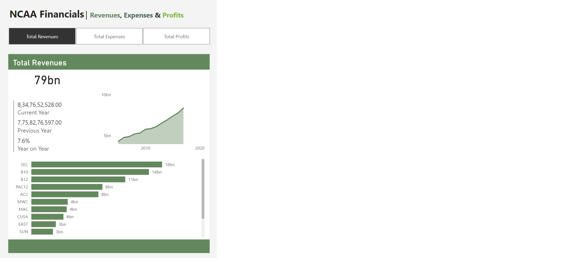

# Week 8

## Requirements

- Create a report view that allows users to toggle between the metrics Total Revenues, Total Expenses, and Total Profits. 
- Create a Measures Table that lets you reference these values using the SWITCH() function, which you must use. 
- Use a horizontal slicer to allow you to toggle between the metrics
- Make sure users aren’t able to see all three metrics at once – we want users to be able to focus on one metrics at a time. 
